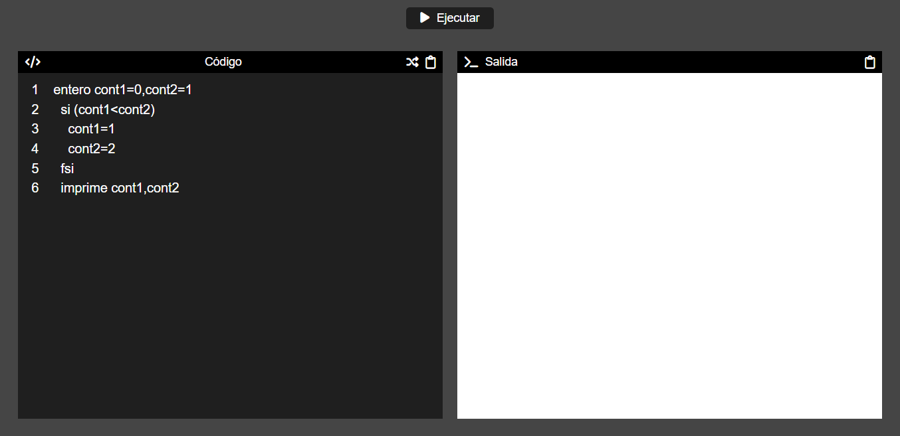
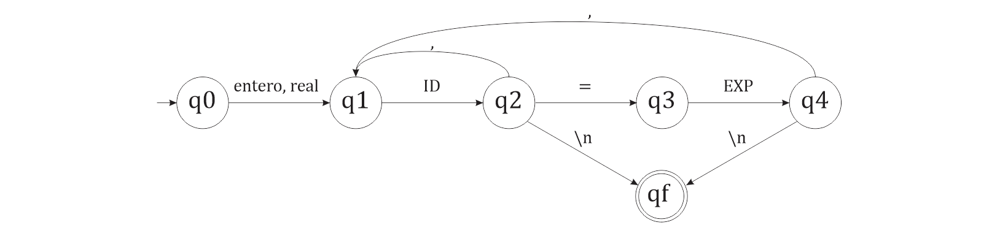
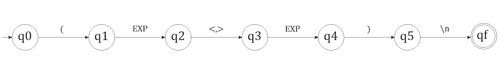
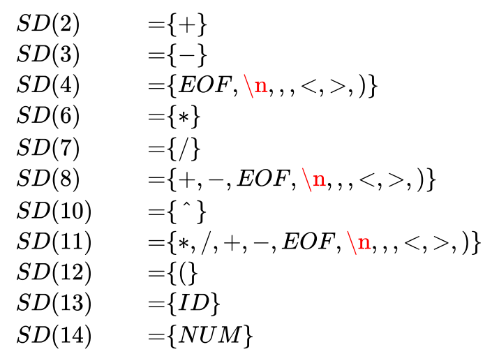

# Proyecto de implementación de Scanner y Parser

## Descripción

Este proyecto es una implementación de un analizador léxico y sintáctico basado en Autómatas Finitos Determinísticos (AFD), Autómatas de Pila Determinista (APD) y un parser LL(1). Está diseñado para analizar un lenguaje de programación personalizado que incluye declaraciones de variables, asignaciones, expresiones, condicionales y una función imprime.

### Flujo de Trabajo

1. El scanner genera tokens de uno en uno conforme se leen los caracteres del código.
2. El parser identifica qué autómata o parser secundario debe ser llamado para procesar los siguientes tokens.
3. Si el autómata o parser secundario reconoce la estructura, el parser principal continúa con el siguiente token.

## Cómo ejecutar el proyecto

Puede ver el proyecto en funcionamiento en [este enlace](https://divorcedlance.github.io/scanner-parser/).

Si desea ejecutar el proyecto de manera local, siga estos pasos:

1. Clone el repositorio en su máquina local:

```
git clone https://github.com/divorcedlance/scanner-parser.git
```

2. Acceda al directorio del proyecto:

```
cd scanner-parser
```

3. Abra el archivo `index.html` en su navegador. **Nota:** Puede que necesite utilizar un servidor local para que el JavaScript se cargue correctamente. Puede usar una extensión como "Live Server" en Visual Studio Code o cualquier otro servidor web local que prefiera.

## Interfaz de Usuario

La interfaz de usuario se divide en dos secciones principales: el área de código y el área de salida. El área de código se utiliza para ingresar el código fuente y el área de salida se utiliza para mostrar los resultados del análisis.



### Área de Código

El área de código tiene un área de texto que se puede utilizar para ingresar el código fuente. También tiene 2 botones uno para copiar el código fuente y otro para usar un ejemplo de código aleatorio.

### Área de Salida

El área de salida tiene un área de texto que se utiliza para mostrar los resultados del análisis. También tiene un botón para copiar el texto de salida al portapapeles.

## Descripción de la implementación

El proceso de análisis de código se ejecuta a través de la función `run`, que actúa como un conductor que guía el flujo del código a través de varias etapas, desde su entrada hasta la producción de un resultado. Aquí te presento un desglose paso a paso:

* El scanner genera uno por uno tokens a partir del código dado. Cada token tiene un tipo y un valor, además de la información para ubicarlo en el código fuente. 
  * Si el token es desconocido, se genera un error léxico. 
  * Si se llega al final del código fuente, se genera un token especial `EOF` que indica el final del archivo.
* El parser identifica qué autómata o parser secundario debe ser llamado para procesar los tokens.
* Cuando se encuentra un token inicial, se llama al AFD o APD correspondiente para evaluar la secuencia de tokens.
  - En el caso de los AFD se usa el método `evaluarAFD` para evaluar la secuencia de tokens. Este método genera un error si la secuencia no sigue las reglas del AFD. Además en el caso de que en el estado actual tengamos una transición valida usando una expresión se usará el parser secundario LL(1) a través del método `evaluarExpresion` para evaluarla.
  - En el caso del APD se usa el método `evaluarAPD` para evaluar la secuencia de tokens. El APD se encarga principalmente de las estructuras de control, como "si", "sino", "mientras" y sus respectivas finalizaciones. Este método genera un error si la secuencia no sigue las reglas del APD. Además en el caso de que la estructura requiera una condicional se llamará al `AFD4` para evaluar la condicional.
* Si el AFD o APD reconoce la estructura, el parser principal continúa con el siguiente token como inicial.
* Si en algún momento se genera un error, el parser principal se detiene y se muestra el mensaje de error.
* Si el parser principal llega al final del código fuente, se muestra un mensaje de éxito.

## Implementación del scanner

El scanner, también conocido como analizador léxico, es responsable de transformar el código fuente en una secuencia de tokens, que se utilizan posteriormente en el análisis sintáctico.

### Inicialización
Cuando se crea un objeto de la clase `Scanner`, se inicializan varios atributos:

- `code`: El código fuente que se analizará.
- `TokenType`: Una enumeración de los diferentes tipos de tokens que se pueden encontrar.
- `palabrasReservadas`: Un listado de palabras que el lenguaje reconoce como reservadas.
- `linea`: Un contador que mantiene el seguimiento de la línea actual del código fuente.
- `tokenGenerator`: Una referencia al generador que produce tokens uno a uno.

### Generación de tokens
Para convertir el código en tokens, utilizamos un generador que itera sobre cada carácter del código fuente:

El procedimiento es sencillo:

- Se itera sobre cada carácter.
- Si se encuentra un salto de línea, se aumenta el contador de líneas y se clasifica el lexema si existe.
- Si se encuentra un espacio, símbolo u operador, se clasifica el lexema acumulado y se reinicia. En el caso de símbolos u operandos, estos también se clasifican.
- Si se encuentra una letra o un número, se añade al lexema.
- Cualquier otro carácter se trata como desconocido.

### Clasificación de lexemas
Una vez que se ha identificado un lexema, es necesario determinar a qué tipo de token pertenece. Esto se logra a través del método `clasificarLexema`:

El método verifica si el lexema es:

- Una palabra reservada.
- Un identificador válido.
- Un número (entero o decimal).
- Un operador.
- Un símbolo.
- O cualquier otro carácter desconocido.

Si se encuentra un lexema desconocido, se muestra un mensaje de error utilizando la función `displayError`.

### Obteniendo tokens sucesivos
El método `getToken` permite obtener el siguiente token del código fuente. Internamente, utiliza el generador para obtener tokens y manejar casos especiales, como múltiples saltos de línea consecutivos:

Al final del código fuente, se devuelve un token especial `EOF` que indica el final del archivo.

## Implementación del parser

La clase `Parser` está diseñada para analizar la sintaxis de un lenguaje de programación utilizando varias técnicas, como Autómatas Finitos Deterministas (AFD), Autómatas de Pila Determinista (APD) y un parser LL(1). El parser se encarga de decidir qué técnica utilizar en base al token inicial de una nueva estructura.

### Tokens Iniciales

#### Palabras Reservadas
* `si`, `sino`, `fsi`, `mientras`, `fmientras`: Gestionados por APD.
* `enter`, `real`: Gestionados por AFD1.
* `imprime`: Gestionado por AFD2.

#### Identificadores
* Gestionados por AFD3.

### **1. Autómatas Finitos Deterministas (AFD)**

Estos se utilizan para reconocer estructuras simples como declaraciones de variables, la función `imprime`, asignaciones y condicionales.

#### AFD1: Declaración de Variables



$$
\begin{aligned}
q0, \text{entero} \implies q1 \\
q0, \text{real} \implies q1 \\
q1, \text{ID} \implies q2 \\
q2, \text{=} \implies q3 \\
q2, \text{,} \implies q1 \\
q2, \text{\\n} \implies qf \\
q3, \text{EXP} \implies q4 \\
q4, \text{,} \implies q1 \\
q4, \text{\\n} \implies qf \\
\end{aligned}
$$

Estado inicial: $q0$  
Estados finales: $qf$

```js
this.AFD1 = {
  'name': 'declaración de variables',
  'q0': { 'entero': 'q1', 'real': 'q1' },
  'q1': { 'ID': 'q2' },
  'q2': { ',': 'q1', '=': 'q3', '\n': 'qf', 'EOF': 'qf' },
  'q3': { 'EXP': 'q4' },
  'q4': { ',': 'q1', '\n': 'qf', 'EOF': 'qf' },
  'estado_final': ['qf']
};
```

#### AFD2: Función imprime


$$
\begin{aligned}
q0, \text{imprime} \implies q1 \\
q1, \text{EXP} \implies q2 \\
q2, \text{,} \implies q1 \\
q2, \text{\\n} \implies qf \\
\end{aligned}
$$

Estado inicial: $q0$  
Estados finales: $qf$

```js
this.AFD2 = {
  'name': 'funcion imprime',
  'q0': { 'imprime': 'q1' },
  'q1': { 'EXP': 'q2' },
  'q2': { ',': 'q1', '\n': 'qf', 'EOF': 'qf' },
  'estado_final': ['qf']
};
```

#### AFD3: Asignación


$$
\begin{aligned}
q0, \text{ID} \implies q1 \\
q1, \text{=} \implies q2 \\
q2, \text{EXP} \implies q3 \\
q3, \text{\\n} \implies qf \\
\end{aligned}
$$

Estado inicial: $q0$  
Estados finales: $qf$

```js
this.AFD3 = {
  'name': 'asignación',
  'q0': { 'ID': 'q1' },
  'q1': { '=': 'q2' },
  'q2': { 'EXP': 'q3' },
  'q3': { '\n': 'qf', 'EOF': 'qf' },
  'estado_final': ['qf']
};
```

#### AFD4: Condición



$$
\begin{aligned}
q0, \text{(} \implies q1 \\
q1, \text{EXP} \implies q2 \\
q2, \text{>} \implies q3 \\
q2, \text{<} \implies q3 \\
q3, \text{EXP} \implies q4 \\
q4, \text{)} \implies q 5 \\
q5, \text{\\n} \implies qf \\
\end{aligned}
$$

Estado inicial: $q0$ 
Estados finales: $qf$

```js
this.AFD4 = {
  'name': 'condición',
  'q0': { '(': 'q1' },
  'q1': { 'EXP': 'q2' },
  'q2': { '<': 'q3', '>': 'q3' },
  'q3': { 'EXP': 'q4' },
  'q4': { ')': 'q5' },
  'q5': { '\n': 'qf' },
  'estado_final': ['qf']
};
```

### **2. Autómatas de Pila Determinista (APD)**

Estos se emplean para analizar estructuras de control, como `si`, `sino` y `mientras`.

$$
\begin{aligned}
q0, \text{si}, - &\implies q0, \text{ si} \\
q0, \text{sino}, \text{si} &\implies q0, \text{ sino} \\
q0, \text{fsi}, \text{sino} &\implies q0, \ \&\& \\
q0, \text{fsi}, \text{si} &\implies q0, \ \& \\
q0, \text{mientras}, - &\implies q0, \text{ mientras} \\
q0, \text{fmientras}, \text{mientras} &\implies q0, \& \\
q0, \$, \text{PO} &\implies qf, - \\
\end{aligned}
$$

Estado inicial: $q0$
Estados finales: $qf$

```js
this.APD = {
  'q0': {
    'si': { 'P0': { 'estado': 'q0', 'pila': '+' }, '-': { 'estado': 'q0', 'pila': '+' } },
    'sino': { 'si': { 'estado': 'q0', 'pila': '+' } },
    'fsi': { 'sino': { 'estado': 'q0', 'pila': '&&' }, 'si': { 'estado': 'q0', 'pila': '&' } },
    'mientras': { 'P0': { 'estado': 'q0', 'pila': '+' }, '-': { 'estado': 'q0', 'pila': '+' } },
    'fmientras': { 'mientras': { 'estado': 'q0', 'pila': '&' } }
  }
};
```

### **3. Parser LL(1)**

Se usa para analizar expresiones matemáticas, identificando estructuras como términos, factores y operadores.
#### Gramática
Para las expresiones algebraicas usaremos la gramática $G$ dada por la tupla $G = (N, T, P, E)$, donde $N$ es el conjunto de no terminales, $T_e$ es el conjunto de terminales, $P$ es el conjunto de reglas de producción y $E$ es el símbolo inicial.

**Símbolos No Terminales:** 
- $N = \{E, T, F, G\}$

**Símbolos Terminales:** 
- $T_e = \{+, -, *, /, \ \hat{ \ } \, (, ), \text{ID}, \text{NUM}\}$

**Reglas de Producción:**

$$
\begin{aligned}
E &\implies T+E \\
&\implies T-E \\
&\implies T \\
T &\implies F*T \\
&\implies F/T \\
&\implies F \\
F &\implies G \ \hat{ \ } \ F \\
 &\implies G \\
G &\implies (E)\\
 &\implies ID\\
 &\implies NUM\\
\end{aligned}
$$

#### Factorización
Para evitar ambigüedades y preparar nuestra gramática para el análisis LL(1), hemos factorizado la gramática original:

$$
\begin{aligned}
&1. &E &\implies TX \\
\\
&2. &X &\implies +E \\
&3. &X &\implies -E \\
&4. &X &\implies \lambda \\
\\
&5. &T &\implies FY \\
\\
&6. &Y &\implies *T \\
&7. &Y &\implies /T \\
&8. &Y &\implies \lambda \\
\\
&9. &F &\implies GZ \\
\\
&10. &Z &\implies \ \hat{ \ } \ F \\
&11. &Z &\implies \lambda \\
\\
&12. &G &\implies (E) \\
&13. &G &\implies ID \\
&14. &G &\implies NUM \\
\end{aligned}
$$

#### Conjuntos de Símbolos Directores
Los conjuntos de símbolos directores nos ayudan a tomar decisiones en el análisis sintáctico descendente, indicando cuándo aplicar una regla particular:



Con esto ya podemos implementar el parser LL(1) en nuestro código:

```js
  
evaluarExpresion() {
// Verifica que la expresión sea válida utilizando el parser LL(1)
  try {
    this.E();
  } catch (error) {
    return false;   
  }
  return true;
}
  
// Método E
E() {
  this.T();
  this.X();
}

// Método X
X() {
  switch (this.currentToken.value) {
	  case '+':
		  this.match('+');
		  this.E();
		  break;
	  case '-':
		  this.match('-');
		  this.E();
		  break;
	  case 'EOF':
	  case '\n':
	  case ',':
	  case '<':
	  case '>':
	  case ')':
		  // Lambda
		  break;
	  default:
		  throw new Error(`Token innesperado en X: "${this.currentToken.value}"`);
  }
}

// Método T
T() {
  this.F();
  this.Y();
}

// Método Y
Y() {
  switch (this.currentToken.value) {
	  case '*':
		  this.match('*');
		  this.T();
		  break;
	  case '/':
		  this.match('/');
		  this.T();
		  break;
	  case '+':
	  case '-':
	  case 'EOF':
	  case '\n':
	  case ',':
	  case '<':
	  case '>':
	  case ')':
		  // Lambda
		  break;
	  default:
		  throw new Error(`Token innesperado en Y: "${this.currentToken.value}"`);
  }
}

// Método F
F() {
  this.G();
  this.Z();
}

// Método Z
Z() {
  switch (this.currentToken.value) {
	  case '^':
		  this.match('^');
		  this.F();
		  break;
	  case '*':
	  case '/':
	  case '+':
	  case '-':
	  case 'EOF':
	  case '\n':
	  case ',':
	  case '<':
	  case '>':
	  case ')':
		  // Lambda
		  break;
	  default:
		  throw new Error(`Token innesperado en Z: "${this.currentToken.value}"`);
  }
}

// Método G
G() {
  switch (this.currentToken.value) {
	  case '(':
		  this.match('(');
		  this.E();
		  this.match(')');
		  break;
	  case 'ID':
		  this.match('ID');
		  break;
	  case 'NUM':
		  this.match('NUM');
		  break;
	  default:
		  throw new Error(`Token innesperado en G: "${this.currentToken.value}"`);
  }
}
```

### **Funciones Clave**

#### **Constructor**
- Inicializa los diferentes autómatas (AFD y APD) y otras propiedades.
  
#### **getToken()**
- Obtiene el siguiente token del escáner (`scanner`) y lo almacena en `currentToken`.

#### **evaluarAFD(afd)**
- Toma un AFD como argumento y evalúa la secuencia de tokens.
- Si la secuencia no sigue las reglas del AFD, genera un error.

#### **evaluarAPD()**
- Evalúa el APD para estructuras de control.
- Si no hay una transición definida en el APD basada en el estado actual y el token, genera un error.

#### **actualizarPila(tokenApilado)**
- Modifica la pila del APD según las operaciones definidas.

#### **evaluarExpresion()**
- Evalúa la corrección sintáctica de una expresión usando el parser LL(1).

#### **E, X, T, Y, F, Z, G**
- Representan la gramática del parser LL(1) y analizan las expresiones.

#### **parse()**
- Función principal del analizador.
- Itera a través de los tokens y, basándose en el token actual, decide qué técnica (AFD, APD, LL(1)) usar.

## Implementación en Código

### Estructura del Proyecto

El proyecto se organiza en múltiples archivos y módulos para facilitar la separación de responsabilidades y la mantenibilidad del código:

- `index.html`: Interfaz gráfica del usuario para la entrada del código y visualización de resultados.
- `styles.css`: Hoja de estilos para la interfaz gráfica.
- `app.js`: Contiene la función principal para ejecutar el compilador y manejar la interfaz de usuario.
- `scanner.js`: Contiene la implementación del analizador léxico.
- `parser.js`: Implementa el analizador sintáctico y decide qué autómata llamar.
- `error.js`: Contiene la implementación del sistema de manejo de errores.
- `example_code.js`: Contiene una lista de ejemplos de código que se pueden utilizar para probar el compilador.

### Funciones Principales

#### Función `run()`

Esta función se invoca cada vez que se presiona el botón "Ejecutar" o se utiliza el atajo `Ctrl+Enter`. Coordina la ejecución del analizador léxico y sintáctico y actualiza la salida en la interfaz de usuario.

#### Eventos DOM

Se utilizan eventos DOM para gestionar la interacción con el usuario, como la actualización de números de línea en tiempo real y el desplazamiento del área de texto.

#### Copiar al Portapapeles

Se proporcionan funciones para copiar el código y la salida al portapapeles del usuario, mejorando así la usabilidad del proyecto.

#### Ejemplos de Código

Se proporciona una lista de ejemplos de código que se pueden utilizar para probar el compilador.

### Tratamiento de Errores

El proyecto tiene un sistema robusto para el manejo de errores, que proporciona mensajes de error detallados que especifican el tipo y la línea del error. El sistema de manejo de errores se implementa en el archivo `error.js` y se utiliza en el scanner y el parser. Este no solo permite imprimir el error sino también saltar a la ubicación del token que lo generó en el código fuente.